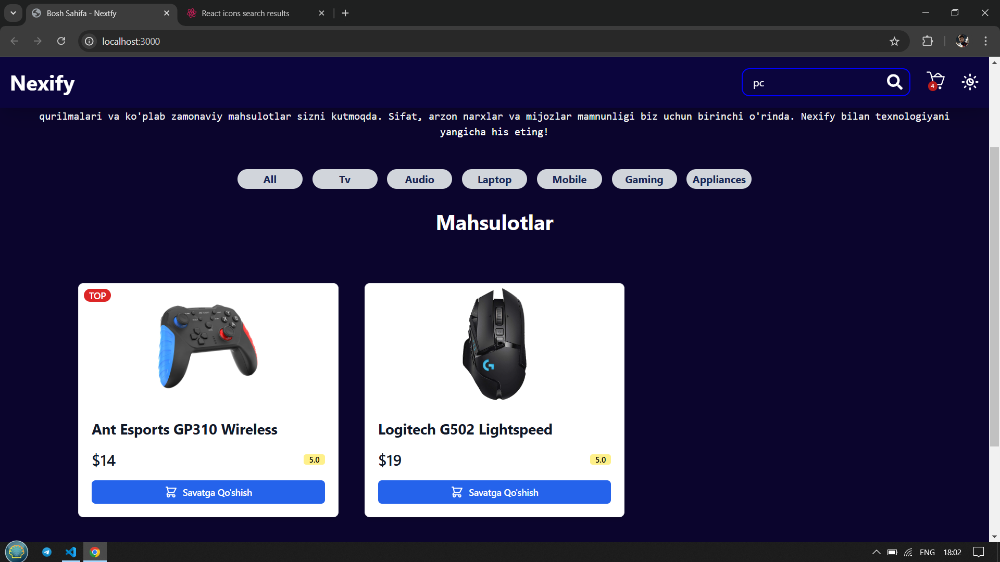
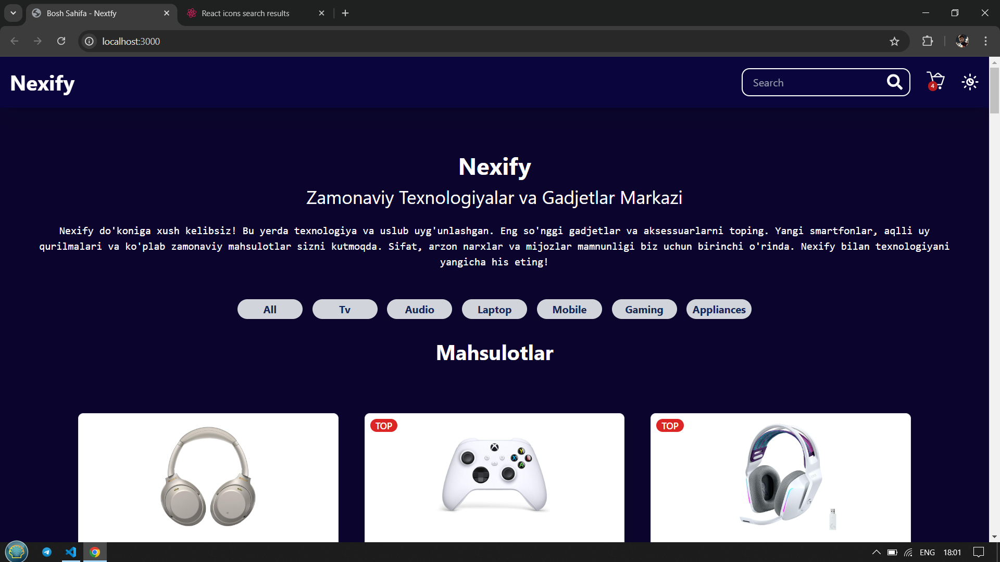
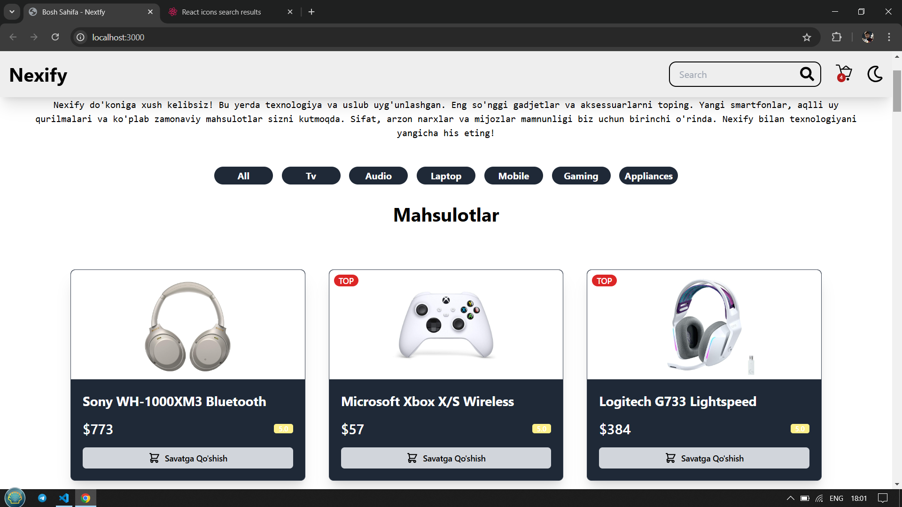

# Nextfy - Mini E-commerce

Nextfy bu kichik e-commerce (onlayn do'kon) sayt bo'lib, Next.js va Tailwind CSS yordamida ishlab chiqilgan. Ushbu loyiha mahsulotlarni ko'rish, qidirish, savatga qo'shish va buyurtma berish funksiyalarini o'z ichiga oladi.

## Xususiyatlari

- 🔍 **Mahsulotlarni qidirish va filtr qilish**: Mahsulotlarni osongina topish uchun qidiruv va turli xil filtr opsiyalari.
- 🌙 **Tungi va Kunduzgi Mavzu**: Saytdan foydalanishda foydalanuvchi ko'z qulayligi uchun tun va kun rejimlariga o'tish imkoniyati.
- 🛒 **Mahsulotlarni savatga qo'shish**: Har bir mahsulotni savatga qo'shish va buyurtmalarni boshqarish imkoniyati.
- 📱 **Moslashuvchan dizayn (Responsive Design)**: Har xil ekran o'lchamlariga mos keladigan dizayn.
- 💡 **Oson va tushunarli interfeys**: Yangi foydalanuvchilar uchun ham qulay va oddiy foydalanish imkoniyati.

## Rasmlar

Quyida loyiha sahifalaridan namunalar:

### Bosh sahifa

### Mahsulot sahifasi

### Savat sahifasi

### Qidiruv sahifasi

### Tungi Mavzu

### Kunduzgi Mavzu

## Muallif

Bu loyiha [Dilmurod](https://github.com/dilmuradd) tomonidan yaratilgan.
