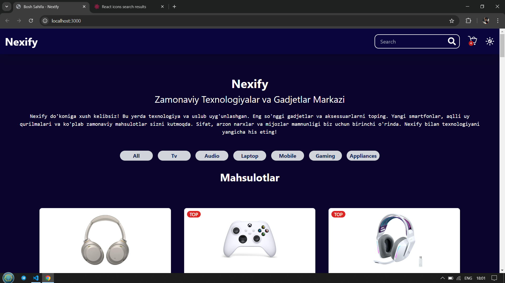
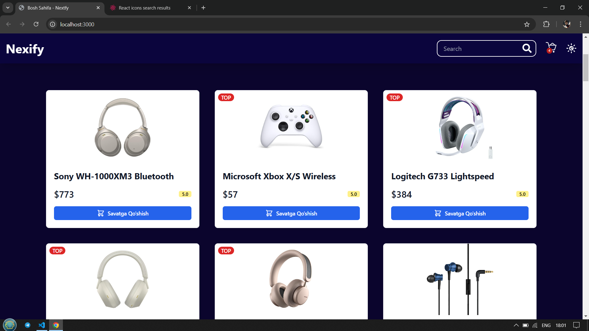
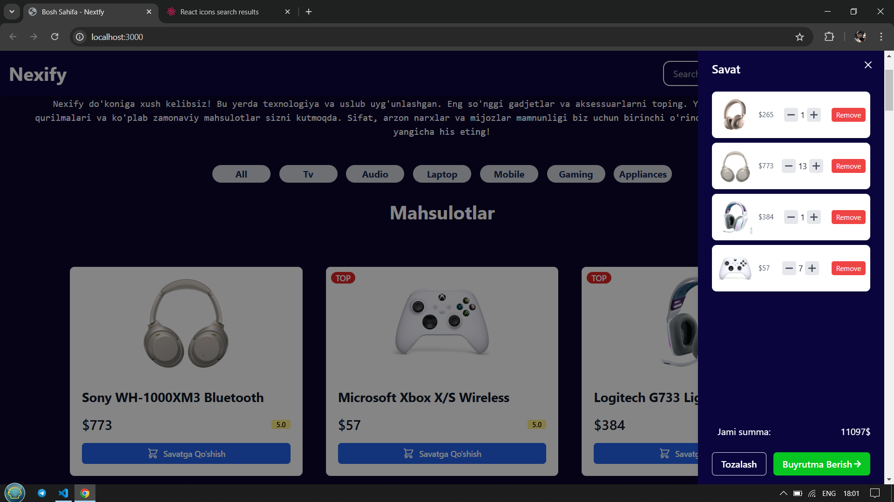

# Nextfy - Mini E-commerce

Nextfy bu kichik e-commerce (onlayn do'kon) sayt bo'lib, Next.js va Tailwind CSS yordamida ishlab chiqilgan. Ushbu loyiha mahsulotlarni ko'rish, qidirish, savatga qo'shish va buyurtma berish funksiyalarini o'z ichiga oladi.

## Xususiyatlari

- 🔍 Mahsulotlarni qidirish va filtr qilish
- 🛒 Mahsulotlarni savatga qo'shish
- 📦 Buyurtma berish va to'lov jarayoni
- 📱 Moslashuvchan dizayn (responsive design)
- 💡 Oson va tushunarli interfeys

## Rasmlar

Quyida loyiha sahifalaridan namunalar:

### Bosh sahifa

### Mahsulot sahifasi

### Savat sahifasi

## Muallif

Bu loyiha [Dilmurod](https://github.com/dilmuradd) tomonidan yaratilgan.
